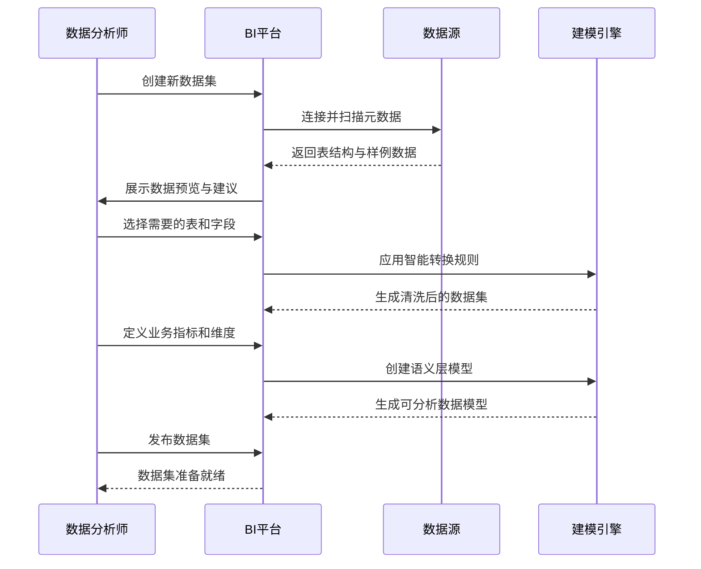
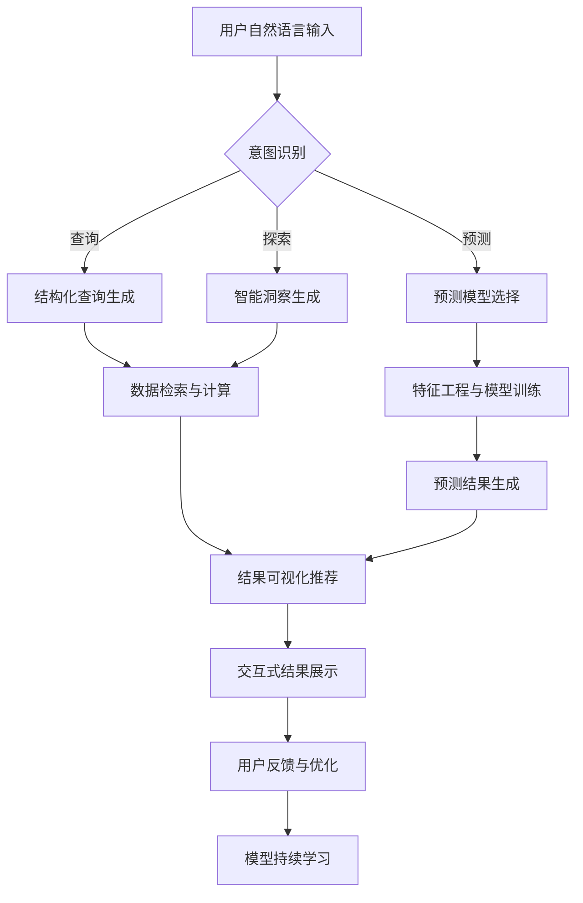

# BI智能分析平台 Auto-Report

## 项目概述
打造一个**未来科技感**的**BI智能分析平台**，采用**SpringBoot 3.2 + Vue3 + TypeScript**技术栈，实现**数据连接、ETL处理、智能建模、可视化分析、预警监控、AI洞察**等完整BI核心业务流程。平台需提供**全息数据驾驶舱**、**自然语言查询**、**AI异常预测**等先进功能，界面采用**深空宇宙+数据流**视觉主题，融合3D图表、粒子动效与霓虹光效，打造科幻级数据体验。无需配置即可体验完整BI能力，支持千万级数据实时分析，开箱即用，面向数据分析师与决策者提供一站式智能决策支持。

## 核心业务模块

### 1. 智能数据源中心
- **多源连接管理**：
  - 30+预置连接器（MySQL, PostgreSQL, Oracle, MongoDB, Elasticsearch, Snowflake, API, CSV, Excel等）
  - 可视化连接配置向导
  - 连接安全策略（SSL, SSH隧道, 证书认证）
  - 实时连接健康监控
- **元数据智能管理**：
  - 自动化元数据扫描
  - 数据字典生成
  - 血缘关系自动追踪
  - 敏感数据自动识别与脱敏
- **数据采集调度**：
  - 可视化ETL流程设计
  - 增量/全量同步策略
  - 任务依赖编排
  - 失败自动重试与告警

### 2. 数据建模引擎
- **智能数据集构建**：
  ```mermaid
  graph TD
    A[原始数据] --> B[数据清洗]
    B --> C[字段转换]
    C --> D[维度建模]
    D --> E[指标计算]
    E --> F[数据集发布]
  ```
- **高级数据处理**：
  - 智能缺失值处理
  - 异常值自动检测
  - 字段类型智能推断
  - 关联关系自动发现
- **语义层管理**：
  - 业务术语映射
  - 计算指标定义（同比、环比、累计等）
  - 维度层级定义（时间、地理、组织等）
  - 业务规则配置引擎

### 3. 全息可视化分析
- **智能图表库**：
  - 50+预设图表类型（3D立体图表、热力地图、桑基图、关系网络图等）
  - AI图表推荐（基于数据特征自动推荐最佳可视化）
  - 多图表联动分析
  - 交互动画过渡
- **智能仪表板**：
  - 拖拽式布局设计（网格+自由模式）
  - 响应式自适应布局
  - 多屏协同展示
  - 仪表板模板库
- **深度分析能力**：
  - 多维度下钻/上卷
  - 交叉分析矩阵
  - 比较分析（时间、基准线）
  - 假设分析（What-If场景模拟）

### 4. AI增强分析
- **自然语言交互**：
  - 语音/文本输入分析需求
  - NL2SQL智能转换
  - 问题意图识别
  - 多轮对话上下文保持
- **预测与洞察**：
  - 时间序列预测（ARIMA, Prophet）
  - 异常检测（Isolation Forest, LSTM）
  - 趋势拐点识别
  - 关键洞察自动提取
- **数据故事生成**：
  - 自动生成分析报告
  - 关键发现智能摘要
  - 可视化叙事模板
  - 多媒体导出（PPT, 视频）

### 5. 预警与监控系统
- **智能KPI监控**：
  - 多维度阈值配置
  - 动态基线预警（基于历史数据自动计算）
  - 异常模式识别
  - 预警级别分级
- **多通道告警**：
  - 系统内通知
  - 邮件/短信告警
  - 企业微信/钉钉集成
  - 告警聚合与抑制
- **预警历史分析**：
  - 告警处理记录
  - 告警准确率统计
  - 优化建议生成
  - 趋势预测

### 6. 协作与共享
- **精细化权限控制**：
  - 基于RBAC的权限模型
  - 行级数据权限（RLS）
  - 字段级数据脱敏
  - 操作审计日志
- **团队协作**：
  - 仪表板/报表共享
  - 数据标注与评论
  - @提及与通知
  - 版本历史与回滚
- **移动体验**：
  - 响应式设计
  - 移动端专用视图
  - 离线查看支持
  - 推送通知

## 技术栈规范

### 后端 (SpringBoot 3.2)
```yaml
core:
  - Spring Boot 3.2.8
  - Java 17
  - Spring WebFlux (响应式)
  - Spring Security OAuth2 (认证)
  
data_processing:
  - Apache Calcite (SQL解析与优化)
  - Apache Arrow (内存数据格式)
  - Apache Flink (流处理)
  - Spring Data JPA (ORM)
  
ai_engine:
  - Python微服务 (ML模型)
  - Apache OpenNLP (NLP)
  - Tribuo (ML库)
  - ONNX Runtime (模型推理)
  
storage:
  - PostgreSQL 15 (元数据)
  - ClickHouse 23.8 (分析型数据)
  - Redis 7.2 (缓存)
  - MinIO (文件存储)
  
devops:
  - Prometheus + Grafana (监控)
  - ELK Stack (日志)
  - Quartz (任务调度)
  - WebSocket (实时推送)
```

### 前端 (Vue3 + TypeScript)
```yaml
core:
  - Vue 3.4.32
  - TypeScript 5.5.4
  - Vite 5.3.1
  - Pinia 2.1.9 (状态管理)
  
visualization:
  - Apache ECharts 5.5.0
  - D3.js 7.8.5
  - Three.js (3D可视化)
  - Deck.gl (地理空间)
  
ai_components:
  - TensorFlow.js
  - Natural (NLP库)
  - ml.js (机器学习)
  - Comlink (Web Worker通信)
  
ui_framework:
  - Custom UI (定制科技组件)
  - Monaco Editor (SQL编辑器)
  - Vue Flow (ETL流程设计)
  - Quill (富文本)
  
effects:
  - Shaders (GLSL着色器)
  - Particles.js (粒子背景)
  - Howler.js (交互动效音)
  - Anime.js (高级动画)
```

## 界面设计规范 (高科技风格)

### 色彩与动效系统
- **宇宙深空主题**：
  - 主背景: #070a17 (深空宇宙)
  - 次级背景: #0e1428 (星云蓝)
  - 主色: #5e60ff (量子蓝)
  - 辅助色: #00e7ff (数据青), #ff2aa9 (警报粉)
  - 文字: #e6f0ff (星光白)
- **霓虹光效规范**：
  - 悬停效果: 0 0 15px #5e60ff66 (元素悬停光晕)
  - 激活状态: 0 0 0 2px #5e60ff, 0 0 10px #5e60ff66 (边框发光)
  - 重要元素: 脉冲动画 (opacity: 1 → 0.7 → 1, 2s循环)
- **3D空间效果**：
  - 元素深度: 使用transform: translateZ()创建层次
  - 视差滚动: 背景慢于前景移动
  - 卡片悬浮: 3D旋转跟随鼠标
  - 全息投影: 关键数据使用glow滤镜

### 核心界面布局
```vue
<template>
  <div class="stardust-bi">
    <!-- 宇宙粒子背景 -->
    <CosmicBackground :stars="500" :nebulas="3" />
    
    <!-- 顶部导航栏 -->
    <header class="navigation-bar">
      <div class="logo-container">
        <div class="logo-hologram">
          <ThreeLogo />
        </div>
        <h1>STARDUST<span class="accent">BI</span></h1>
        <span class="subheading">智能决策宇宙</span>
      </div>
      
      <div class="search-container">
        <AiSearchBar 
          v-model="searchQuery"
          placeholder="用自然语言提问，例如：'上季度销售额最高的产品是什么？'"
          @submit="handleNaturalQuery"
        />
      </div>
      
      <div class="actions-container">
        <NotificationCenter :alerts="activeAlerts" />
        <WorkspaceSwitcher :workspaces="userWorkspaces" />
        <UserProfile />
      </div>
    </header>
    
    <!-- 主内容区 -->
    <div class="main-container">
      <!-- 左侧导航 -->
      <aside class="sidebar">
        <NavigationMenu :items="mainMenu" />
        
        <div class="favorites-section">
          <h3 class="section-title">☆ 我的收藏</h3>
          <FavoriteItems :items="favoriteDashboards" />
        </div>
        
        <div class="space-indicator">
          <h3 class="section-title">🚀 数据空间</h3>
          <StorageMeter 
            :used="usedStorage" 
            :total="totalStorage"
            :warning-threshold="80"
          />
        </div>
      </aside>
      
      <!-- 主内容区 -->
      <main class="content-area">
        <!-- 首页驾驶舱 -->
        <Dashboard v-if="currentView === 'dashboard'" :dashboard-id="activeDashboardId" />
        
        <!-- 数据源管理 -->
        <DataSourceManager v-if="currentView === 'datasources'" />
        
        <!-- 数据建模 -->
        <DataModelingStudio v-if="currentView === 'modeling'" />
        
        <!-- AI分析 -->
        <AiInsights v-if="currentView === 'ai'" :query="aiQuery" />
      </main>
      
      <!-- 右侧面板 - 上下文感知 -->
      <aside class="context-panel" v-if="showContextPanel">
        <ContextPanel 
          :context="contextData"
          :related-insights="relatedInsights"
          :actions="contextActions"
        />
      </aside>
    </div>
    
    <!-- 底部状态栏 -->
    <footer class="status-bar">
      <div class="system-status">
        <span class="status-indicator" :class="{healthy: systemStatus.healthy}"></span>
        <span>{{ systemStatus.message }}</span>
      </div>
      <div class="query-status" v-if="activeQueries.length > 0">
        <span class="query-count">{{ activeQueries.length }} 个查询执行中</span>
        <div class="progress-container">
          <div 
            v-for="(query, index) in activeQueries" 
            :key="index" 
            class="query-progress"
          >
            <span class="query-name">{{ query.name }}</span>
            <div class="progress-bar">
              <div 
                class="progress-fill" 
                :style="{width: query.progress + '%'}"
                :class="query.status"
              ></div>
            </div>
          </div>
        </div>
      </div>
      <div class="timestamp">
        {{ currentTime }}
        <div class="time-zone">UTC+8</div>
      </div>
    </footer>
    
    <!-- 全局AI助手 -->
    <AiAssistant />
  </div>
</template>
```

### 关键界面组件
1. **全息数据驾驶舱**：
   - 3D空间布局仪表板
   - 全息投影效果的KPI卡片
   - 实时数据流动动画
   - 智能焦点（根据用户行为高亮关键指标）

2. **自然语言查询界面**：
   - 语音波纹可视化
   - 查询理解进度可视化
   - 意图识别可视化（NLP处理流程）
   - 多结果选项展示

3. **3D数据探索器**：
   - 交互式3D散点图
   - 多维数据空间导航
   - 聚类分析可视化
   - 异常点突出显示

4. **数据血缘图谱**：
   - 力导向图展示数据关系
   - 影响范围传播动画
   - 实时更新状态标记
   - 点击钻取详情

## 核心业务流程

### 1. 数据准备流程


### 2. AI分析流程


### 3. 预警处理流程
1. **指标监控**：
   - 每分钟检查KPI阈值
   - 计算动态基线（基于历史同期数据）
   - 识别异常模式（突增/突降、波动异常）
2. **预警触发**：
   - 低风险：系统内通知
   - 中风险：邮件通知 + 系统标记
   - 高风险：短信/电话 + 系统告警 + 自动创建工单
3. **闭环处理**：
   - 预警确认与标记
   - 根本原因分析建议
   - 处理记录与知识积累
   - 预警规则持续优化

## API接口设计

### 核心API端点
```java
@RestController
@RequestMapping("/api/v1")
@Tag(name = "BI Platform API", description = "星瀚BI智能分析平台核心API")
public class BiPlatformController {

    // 1. 数据源管理
    @Operation(summary = "创建新数据源")
    @PostMapping("/datasources")
    public ResponseEntity<DataSourceResponse> createDataSource(
            @Valid @RequestBody DataSourceRequest request) {
        // 验证连接
        // 保存配置
        // 返回数据源ID
    }
    
    @Operation(summary = "测试数据源连接")
    @PostMapping("/datasources/test")
    public ResponseEntity<ConnectionTestResult> testDataSourceConnection(
            @RequestBody DataSourceRequest request) {
        // 尝试连接
        // 返回连接状态与元数据
    }
    
    // 2. 数据集与建模
    @Operation(summary = "创建新数据集")
    @PostMapping("/datasets")
    public ResponseEntity<DatasetResponse> createDataset(
            @Valid @RequestBody DatasetCreationRequest request) {
        // 创建数据集定义
        // 初始化ETL流程
        // 返回数据集信息
    }
    
    @Operation(summary = "执行查询")
    @PostMapping("/datasets/{datasetId}/query")
    public ResponseEntity<QueryResult> executeQuery(
            @PathVariable String datasetId,
            @RequestBody QueryRequest request) {
        // 验证权限
        // 生成优化SQL
        // 执行查询
        // 返回结构化结果
    }
    
    // 3. AI分析
    @Operation(summary = "自然语言查询")
    @PostMapping("/ai/query")
    public ResponseEntity<AiQueryResponse> naturalLanguageQuery(
            @RequestBody NaturalLanguageRequest request) {
        // NLP处理
        // 生成结构化查询
        // 执行并分析结果
        // 生成自然语言回答
    }
    
    @Operation(summary = "获取预测洞察")
    @GetMapping("/ai/predictions/{metric}")
    public ResponseEntity<PredictionResult> getPredictions(
            @PathVariable String metric,
            @RequestParam String timeframe) {
        // 选择预测模型
        // 训练/加载模型
        // 生成预测
        // 返回可视化就绪数据
    }
    
    // 4. 仪表板管理
    @Operation(summary = "创建新仪表板")
    @PostMapping("/dashboards")
    public ResponseEntity<DashboardResponse> createDashboard(
            @Valid @RequestBody DashboardCreationRequest request) {
        // 创建仪表板结构
        // 保存布局配置
        // 返回仪表板ID
    }
    
    @Operation(summary = "导出仪表板报告")
    @GetMapping("/dashboards/{dashboardId}/export")
    public ResponseEntity<Resource> exportDashboard(
            @PathVariable String dashboardId,
            @RequestParam ExportFormat format) {
        // 生成导出内容
        // 返回文件资源
    }
}
```

### 关键DTO结构
```java
@Data
@Builder
@Schema(description = "数据集定义")
public class Dataset {
    @Schema(description = "唯一标识符")
    private String id;
    
    @Schema(description = "数据集名称")
    private String name;
    
    @Schema(description = "业务描述")
    private String description;
    
    @Schema(description = "关联数据源ID")
    private String dataSourceId;
    
    @Schema(description = "维度字段定义")
    private List<DimensionField> dimensions;
    
    @Schema(description = "指标字段定义")
    private List<MetricField> metrics;
    
    @Schema(description = "ETL处理规则")
    private EtlConfiguration etlConfig;
    
    @Schema(description = "数据刷新策略")
    private RefreshPolicy refreshPolicy;
    
    @Schema(description = "创建时间")
    private LocalDateTime createdAt;
    
    @Schema(description = "最后更新时间")
    private LocalDateTime updatedAt;
}

@Data
@Schema(description = "AI查询请求")
public class NaturalLanguageRequest {
    @Schema(description = "自然语言问题", example = "上个月销售额最高的产品类别是什么？")
    @NotBlank
    private String question;
    
    @Schema(description = "上下文信息（可选）")
    private Map<String, Object> context;
    
    @Schema(description = "期望的数据集（可选）")
    private String preferredDatasetId;
    
    @Schema(description = "是否需要可视化建议", defaultValue = "true")
    private boolean suggestVisualizations = true;
    
    @Schema(description = "分析深度（1-5）", defaultValue = "3")
    @Min(1)
    @Max(5)
    private int depth = 3;
}
```

## 代码目录结构

### 后端结构
```
src/main/java/com/stardustbi/
├── config/
│   ├── AiConfig.java               # AI模型配置
│   ├── SecurityConfig.java         # 安全配置
│   ├── DataSourceConfig.java       # 数据源配置
│   └── AsyncConfig.java            # 异步任务配置
├── controller/
│   ├── DataSourceController.java   # 数据源管理
│   ├── DatasetController.java      # 数据集管理
│   ├── DashboardController.java    # 仪表板管理
│   ├── AiController.java           # AI分析
│   ├── AlertController.java        # 预警管理
│   └── ReportController.java       # 报表管理
├── domain/
│   ├── model/
│   │   ├── DataSource.java         # 数据源实体
│   │   ├── Dataset.java            # 数据集实体
│   │   ├── Dashboard.java          # 仪表板实体
│   │   ├── AlertRule.java          # 预警规则
│   │   └── AiInsight.java          # AI洞察
│   ├── repository/
│   ├── service/
│   └── event/
├── application/
│   ├── query/
│   │   ├── QueryEngine.java        # 查询引擎
│   │   ├── SqlGenerator.java       # SQL生成器
│   │   └── ResultProcessor.java    # 结果处理器
│   ├── ai/
│   │   ├── NlpEngine.java          # NLP引擎
│   │   ├── PredictionService.java  # 预测服务
│   │   └── InsightGenerator.java   # 洞察生成
│   ├── etl/
│   │   ├── EtlOrchestrator.java    # ETL编排
│   │   ├── DataCleaner.java        # 数据清洗
│   │   └── DataQualityChecker.java # 质量检查
│   └── visualization/
│       ├── ChartRecommender.java   # 图表推荐
│       └── VisualizationBuilder.java # 可视化构建
├── infrastructure/
│   ├── database/
│   ├── cache/
│   ├── storage/
│   └── messaging/
├── common/
│   ├── exception/
│   ├── response/
│   ├── security/
│   └── utils/
└── StardustBiApplication.java
```

### 前端结构
```
src/
├── api/
│   ├── datasources.js              # 数据源API
│   ├── datasets.js                 # 数据集API
│   ├── dashboards.js               # 仪表板API
│   ├── ai.js                       # AI分析API
│   └── alerts.js                   # 预警API
├── assets/
│   ├── fonts/                      # 定制字体
│   ├── shaders/                    # GLSL着色器
│   ├── particles/                  # 粒子效果
│   └── sounds/                     # 交互动效音
├── components/
│   ├── core/
│   │   ├── CosmicBackground.vue    # 宇宙背景
│   │   ├── NeonButton.vue          # 霓虹按钮
│   │   └── HologramCard.vue        # 全息卡片
│   ├── data/
│   │   ├── DataSourceCard.vue
│   │   ├── DatasetBuilder.vue
│   │   └── SqlEditor.vue
│   ├── visualization/
│   │   ├── ChartRenderer.vue
│   │   ├── ThreeDChart.vue
│   │   ├── DataFlowMap.vue
│   │   └── RelationGraph.vue
│   ├── ai/
│   │   ├── AiSearchBar.vue
│   │   ├── NaturalLanguagePanel.vue
│   │   └── InsightCarousel.vue
│   ├── dashboard/
│   │   ├── DashboardCanvas.vue
│   │   ├── WidgetContainer.vue
│   │   └── LayoutDesigner.vue
│   └── utils/
│       ├── PermissionGuard.vue
│       └── LoadingSpinner.vue
├── composables/
│   ├── useChartTheme.js            # 图表主题
│   ├── useAiAssistant.js           # AI助手
│   ├── useDataDrilldown.js         # 数据下钻
│   └── useRealtimeUpdates.js       # 实时更新
├── router/
│   └── index.js                    # 路由配置
├── stores/
│   ├── datasetStore.js             # 数据集状态
│   ├── dashboardStore.js           # 仪表板状态
│   ├── aiStore.js                  # AI状态
│   └── userStore.js                # 用户状态
├── styles/
│   ├── theme.scss                  # 主题样式
│   ├── animations.scss             # 动画效果
│   ├── neon-effects.scss           # 霓虹效果
│   └── hologram.scss               # 全息效果
├── utils/
│   ├── timeUtils.js                # 时间处理
│   ├── numberFormat.js             # 数字格式化
│   ├── aiUtils.js                  # AI工具
│   └── colorUtils.js               # 颜色处理
├── views/
│   ├── Home.vue                    # 首页
│   ├── DataSourceManagement.vue    # 数据源管理
│   ├── DataModelingStudio.vue      # 建模工作室
│   ├── DashboardView.vue           # 仪表板视图
│   ├── AiAnalysis.vue              # AI分析
│   └── AlertCenter.vue             # 预警中心
├── App.vue
└── main.js
```

## 模拟数据与AI服务

### 1. 智能查询引擎
```java
@Service
@RequiredArgsConstructor
public class SmartQueryEngine {
    
    private final NlpService nlpService;
    private final QueryOptimizer queryOptimizer;
    private final VisualizationRecommender vizRecommender;
    
    public QueryResult processNaturalLanguageQuery(String query, String userId) {
        // 1. NLP处理
        QueryIntent intent = nlpService.analyzeIntent(query, userId);
        
        // 2. 生成结构化查询
        SqlQuery sqlQuery = generateSqlFromIntent(intent);
        
        // 3. 优化查询
        OptimizedQuery optimizedQuery = queryOptimizer.optimize(sqlQuery);
        
        // 4. 执行查询
        RawDataResult rawData = executeQuery(optimizedQuery);
        
        // 5. 生成洞察
        AiInsights insights = generateInsights(rawData, intent);
        
        // 6. 推荐可视化
        List<RecommendedChart> charts = vizRecommender.recommend(rawData, intent);
        
        // 7. 生成自然语言回答
        String naturalAnswer = generateNaturalLanguageResponse(insights);
        
        return QueryResult.builder()
                .rawData(rawData)
                .insights(insights)
                .recommendedCharts(charts)
                .naturalAnswer(naturalAnswer)
                .queryMetadata(QueryMetadata.builder()
                        .executionTime(optimizedQuery.getExecutionTime())
                        .dataSize(rawData.getRowCount())
                        .confidenceScore(intent.getConfidence())
                        .build())
                .build();
    }
    
    private SqlQuery generateSqlFromIntent(QueryIntent intent) {
        // 基于意图生成SQL
        // 处理维度、指标、过滤条件、排序等
        SqlQueryBuilder builder = new SqlQueryBuilder(intent.getDataset());
        
        // 添加指标
        intent.getMetrics().forEach(builder::addMetric);
        
        // 添加维度
        intent.getDimensions().forEach(builder::addDimension);
        
        // 添加过滤条件
        intent.getFilters().forEach(builder::addFilter);
        
        // 添加排序
        if (intent.getOrderBy() != null) {
            builder.orderBy(intent.getOrderBy(), intent.getSortDirection());
        }
        
        // 限制返回行数
        builder.limit(10000);
        
        return builder.build();
    }
}
```

### 2. 预测洞察服务
```java
@Service
public class PredictionService {
    
    private final Map<String, PredictionModel> modelCache = new ConcurrentHashMap<>();
    
    @Scheduled(fixedRate = 3600000) // 每小时更新模型
    public void refreshModels() {
        // 刷新所有预测模型
        List<String> metrics = metricRepository.findAllMetricNames();
        metrics.forEach(this::trainOrRefreshModel);
    }
    
    public PredictionResult predict(String metricName, TimeRange forecastRange) {
        // 获取或训练模型
        PredictionModel model = getModel(metricName);
        
        // 准备历史数据
        List<MetricPoint> historicalData = metricRepository.findHistoricalData(
                metricName, 
                forecastRange.extendBackward(90) // 90天历史
        );
        
        // 生成预测
        List<PredictionPoint> predictions = model.predict(historicalData, forecastRange);
        
        // 检测异常
        List<Anomaly> anomalies = detectAnomalies(historicalData, predictions);
        
        // 生成洞察
        List<Insight> insights = generateInsights(predictions, anomalies);
        
        return PredictionResult.builder()
                .metricName(metricName)
                .predictions(predictions)
                .anomalies(anomalies)
                .insights(insights)
                .confidenceIntervals(calculateConfidenceIntervals(predictions))
                .build();
    }
    
    private PredictionModel getModel(String metricName) {
        return modelCache.computeIfAbsent(metricName, this::trainNewModel);
    }
    
    private PredictionModel trainNewModel(String metricName) {
        // 选择最佳模型
        List<MetricPoint> trainingData = metricRepository.getTrainingData(metricName, 180);
        
        // 尝试多个模型
        Map<String, Double> modelAccuracies = new HashMap<>();
        modelAccuracies.put("prophet", evaluateProphetModel(trainingData));
        modelAccuracies.put("arima", evaluateArimaModel(trainingData));
        modelAccuracies.put("lstm", evaluateLstmModel(trainingData));
        
        // 选择最准确的模型
        String bestModel = modelAccuracies.entrySet().stream()
                .max(Map.Entry.comparingByValue())
                .map(Map.Entry::getKey)
                .orElse("prophet");
        
        // 训练并返回
        return switch (bestModel) {
            case "prophet" -> trainProphetModel(trainingData);
            case "arima" -> trainArimaModel(trainingData);
            case "lstm" -> trainLstmModel(trainingData);
            default -> trainProphetModel(trainingData);
        };
    }
}
```

## 部署与运行

### 1. 本地开发环境
```bash
# 后端
./mvnw spring-boot:run -Dspring-boot.run.profiles=dev

# 前端
npm install
npm run dev

# 模拟数据服务 (可选)
docker-compose up -d mock-data-service
```

### 2. 生产环境部署
```yaml
# docker-compose.prod.yml
version: '3.8'
services:
  app:
    image: stardustbi/platform:latest
    ports:
      - "8080:8080"
    environment:
      - SPRING_PROFILES_ACTIVE=prod
      - DATABASE_URL=jdbc:postgresql://postgres:5432/stardustbi
      - AI_SERVICE_URL=http://ai-service:8000
      - REDIS_URL=redis://redis:6379
    depends_on:
      - postgres
      - redis
      - clickhouse
      - ai-service
  
  postgres:
    image: postgres:15
    environment:
      POSTGRES_DB: stardustbi
      POSTGRES_USER: stardust
      POSTGRES_PASSWORD: secure_password_123
  
  redis:
    image: redis:7.2-alpine
    command: redis-server --save 60 1 --loglevel warning
  
  clickhouse:
    image: clickhouse/clickhouse-server:23.8
    ulimits:
      nofile:
        soft: 262144
        hard: 262144
  
  ai-service:
    image: stardustbi/ai-service:latest
    environment:
      - MODEL_CACHE_SIZE=10GB
    deploy:
      resources:
        reservations:
          memory: 8G
          cpus: '2.0'
  
  nginx:
    image: nginx:alpine
    ports:
      - "80:80"
      - "443:443"
    volumes:
      - ./nginx.conf:/etc/nginx/nginx.conf
      - ./certs:/etc/nginx/certs
```

### 3. 关键环境变量
```
# 应用配置
APP_ENV=production
APP_NAME=StardustBI
SERVER_PORT=8080

# 数据库
SPRING_DATASOURCE_URL=jdbc:postgresql://postgres:5432/stardustbi
SPRING_DATASOURCE_USERNAME=stardust
SPRING_DATASOURCE_PASSWORD=secure_password_123
CLICKHOUSE_URL=jdbc:clickhouse://clickhouse:8123/default

# 缓存
SPRING_REDIS_HOST=redis
SPRING_REDIS_PORT=6379
CACHE_EXPIRATION_SECONDS=3600

# AI服务
AI_SERVICE_URL=http://ai-service:8000
PREDICTION_MODEL_REFRESH_HOURS=6
NLP_CONFIDENCE_THRESHOLD=0.7

# 安全
JWT_SECRET=your_strong_jwt_secret_here_123!@#
SECURITY_RATE_LIMIT=100

# 对象存储
MINIO_URL=http://minio:9000
MINIO_ACCESS_KEY=minioadmin
MINIO_SECRET_KEY=minioadmin
```

## 质量与验收标准

### 1. 功能验收
- [ ] 支持10+数据源连接
- [ ] ETL流程可视化设计
- [ ] 50+图表类型渲染
- [ ] 自然语言查询准确率≥85%
- [ ] 预测准确率≥80% (常见业务指标)
- [ ] 仪表板拖拽布局流畅
- [ ] 实时数据更新延迟<1s
- [ ] 千万级数据秒级响应

### 2. 界面验收
- [ ] 宇宙粒子背景动态交互
- [ ] 所有按钮具备霓虹发光效果
- [ ] 3D图表旋转流畅(60fps)
- [ ] 全息卡片悬浮效果
- [ ] 色彩对比度符合WCAG 2.1
- [ ] 响应式布局适配(1366px+)
- [ ] 交互动效音反馈
- [ ] 深色模式无闪烁

### 3. 性能指标
- [ ] 首屏加载时间<1.5s
- [ ] 仪表板切换<300ms
- [ ] 100万行数据分析<5s
- [ ] API P95响应<500ms
- [ ] 内存占用<1GB(常规使用)
- [ ] 支持50+并发用户

## 特别强调

1. **真实BI能力**：
   - 不是简单图表展示，必须实现完整BI分析流程
   - 数据质量检查必须自动执行
   - 业务指标计算必须精确
   - 预警规则必须智能动态基线

2. **震撼视觉体验**：
   - 宇宙粒子背景必须随鼠标移动
   - 重要数据必须使用全息投影效果
   - 3D图表必须支持交互旋转
   - 霓虹元素必须脉冲发光
   - 关键操作必须有音效反馈

3. **AI深度集成**：
   - 自然语言必须理解业务上下文
   - 预测模型必须自动选择最优算法
   - 异常检测必须区分业务异常与数据异常
   - 洞察生成必须提供可操作建议

4. **开箱即用**：
   - 启动即提供示例数据集
   - 预置10+行业仪表板模板
   - 首次访问显示3D交互式教程
   - 无需配置即可体验完整功能

5. **企业级特性**：
   - 行级数据权限精确控制
   - 完整操作审计日志
   - 任务失败自动重试
   - 资源使用监控与告警

> **交付要求**：生成完整可运行项目，启动后访问 http://localhost:8080 即可体验。界面必须达到科幻电影级视觉效果，所有3D效果流畅运行，AI分析功能真实可用，支持模拟千万级数据分析。代码注释率≥40%，提供完整README包含架构说明、部署指南与使用教程。系统必须支持50+并发用户，性能指标符合验收标准。最终交付物应让用户感受到专业级BI平台的强大能力与视觉震撼，为数据决策提供直观、智能、高效的体验。